# Preparing 5-Node Kubernetes Cluster

### Students:

-   Brenda Godinez Lozano
-   Karla Lizbeth Ramirez Perez

## Introduction

In this practice kubernetes will be used, which is an open source platform used to manage workloads and services, likewise, it facilitates automation and declarative configuration, using the simulator provided by Docker and created by Tutorius named play with kubernetes . Where a kubernetes cluster will be created, which is a set of node machines that run containerized applications, which is composed of a master node and one or more slave nodes and its kubernetes function is to describe the desired state of the cluster.

## Objective

Create a Kubernetes cluster to manage workloads and services, making it easy to automate and eliminate many of the manual processes during the deployment and scaling of containerized applications.

### Specific Objectives

-   Identify virtualization tools to create a gaming cluster with Kubernetes.
-   Creation of a master node and its slave nodes.
-   Analyze the behavior of nodes using portainer.

## Process

### Preparing 5-Node Kubernetes Cluster

To get started with Kubernetes, follow the below steps:

-   Open https://labs.play-with-k8s.com/ on your browser

Click on Add Instances to setup first k8s node cluster

### Run the below command:

`kubeadm init --apiserver-advertise-address $(hostname -i) mkdir -p $HOME/.kube chown $(id -u):$(id -g) $HOME/.kube/config kubectl apply -n kube-system -f \ "https://cloud.weave.works/k8s/net?k8s-version=$(kubectl version | base64 |tr -d '\n')"`

### Result 'kubeadm init'

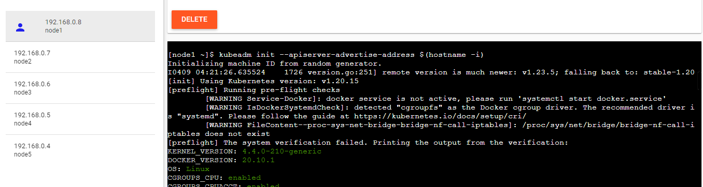

> Img 1. Use this command to initialize the master node.

### Results 'kubectl apply'

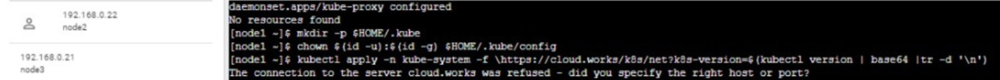

> Img 2. We use the kubectl apply command to create or modify Kubernetes resources defined in a manifest file.

## Adding New K8s Cluster Node

Click on Add Instances to setup first k8s node cluster.

Wait for 1 minute time till it gets completed.

Copy the command starting with kubeadm join ..... We will need it to be run on the worker node.

## Setting up Worker Node

Click on
`Add New Instance`
and paste the last `kubeadm` command on this fresh new worker node.

> [node2 ~]$ kubeadm join --token 4f924f.14eb7618a20d2ece 192.168.0.8:6443 --discovery-token-ca-cert-hash sha256:a5c25aa4573e06a0c11b11df23c8f85c95bae36cbb07d5e7879d9341a3ec67b

You will see the below output:
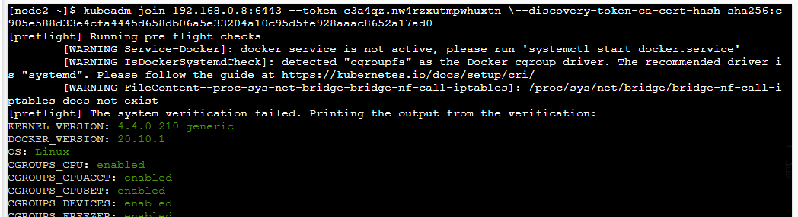

> Img 3. The token generated on the master node is added to create the first slave node.

### Verifying Kubernetes Cluster

Run the below command on master node.

`[node1 ~]$ kubectl get nodes NAME STATUS ROLES AGE VERSION node1 Ready master 15m v1.10.2 node2 Ready <none> 1m v1.10.2 [node1 ~]$`

### Results Verifying Kubernetes Cluste

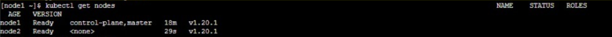

> Img 4. We verify that the slave node has been created correctly.

### Adding Worker Nodes

`[node1 ~]$ kubectl get nodes NAME STATUS ROLES AGE VERSION node1 Ready master 58m v1.10.2 node2 Ready <none> 57m v1.10.2 node3 Ready <none> 57m v1.10.2 node4 Ready <none> 57m v1.10.2 node5 Ready <none> 54s v1.10.2 `

### Results Adding Worker Nodes

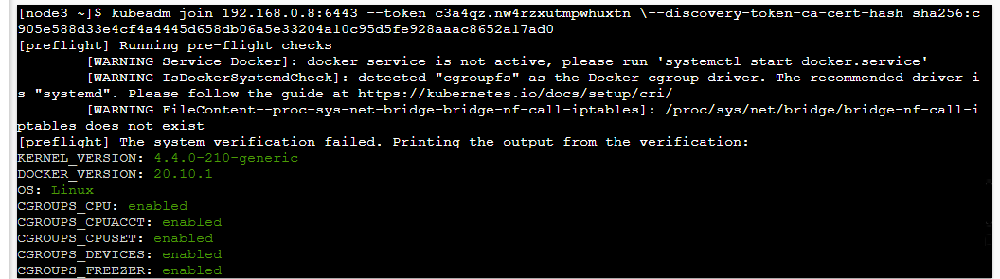

> Img 5. The token generated on the master node is added to create the second slave node.

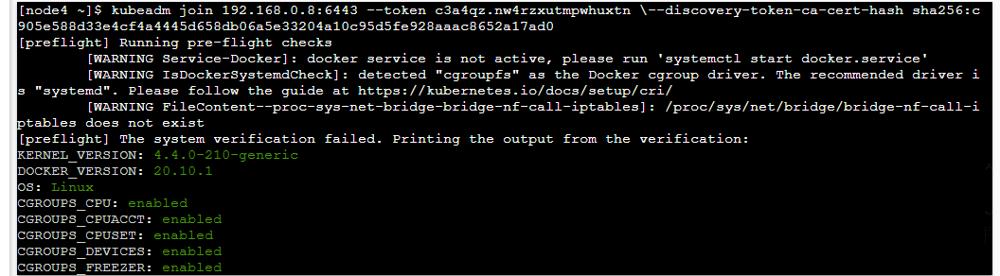

> Img 6. The token generated on the master node is added to create the third slave node.

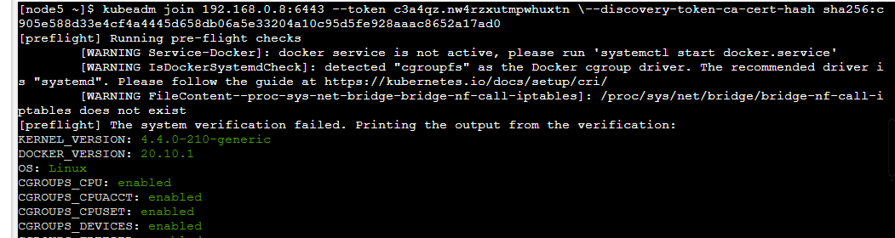

> Img 7. The token generated on the master node is added to create the fourth slave node.

### Verifying Kubernetes Cluster

`[node1 istio]$ kubectl get po No resources found.`

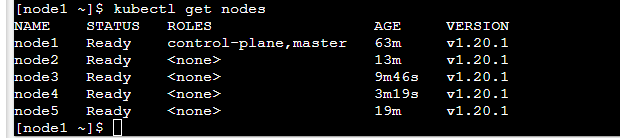

> Img 8. We verify that the slave nodes have been created correctly.

`[node1 ]$ kubectl get svc NAME TYPE CLUSTER-IP EXTERNAL-IP PORT(S) AGE kubernetes ClusterIP 10.96.0.1 <none> 443/TCP 1h`

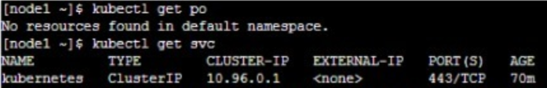

> Img 9. We verify that the Pods are not running.

### Show the capacity of all our nodes as a stream of JSON objects

`kubectl get nodes -o json | jq ".items[] | {name:.metadata.name} + .status.capacity"`

### Results Show the capacity

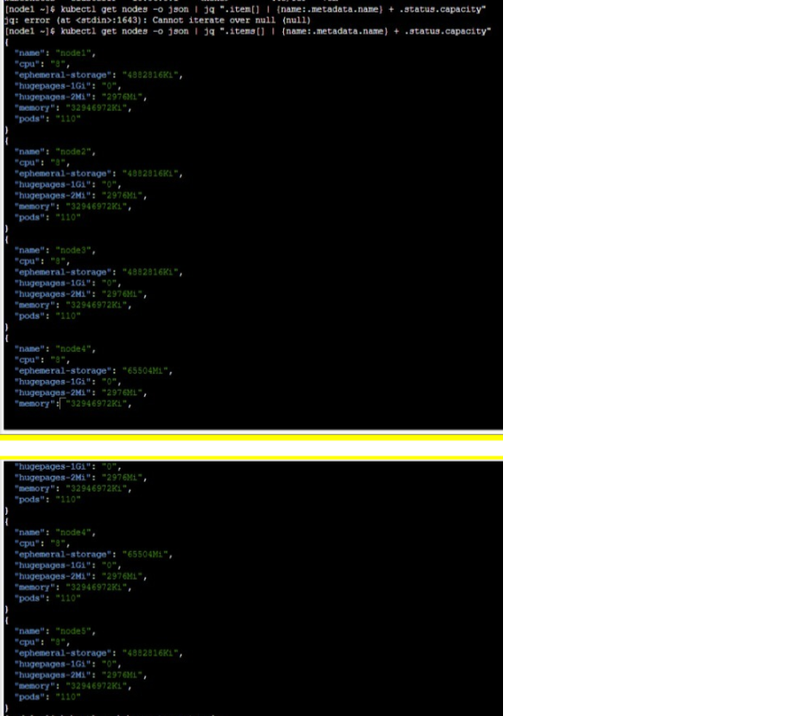

> Img 10. The information of the active nodes is displayed in ".json" format.

## Accessing namespaces

By default, `kubectl` uses the default namespace. We can switch to a different namespace with the -n option

### List the pods in the kube-system namespace:

`kubectl -n kube-system get pods`

`[node1 kubelabs]$ kubectl get pods -n kube-system NAME READY STATUS RESTARTS AGE coredns-6dcc67dcbc-4sw6m 1/1 Running 0 2m15s coredns-6dcc67dcbc-x4qnk 1/1 Running 0 2m15s etcd-node1 1/1 Running 0 108s kube-apiserver-node1 1/1 Running 0 84s kube-controller-manager-node1 1/1 Running 0 104s kube-proxy-9gljr 1/1 Running 0 2m5s kube-proxy-9zktt 1/1 Running 0 2m15s kube-proxy-qvqrf 1/1 Running 0 107s kube-scheduler-node1 1/1 Running 0 105s weave-net-78bxz 2/2 Running 0 2m15s weave-net-g2cf6 2/2 Running 0 2m5s weave-net-hxqd9 0/2 Evicted 0 19s`

### Results List the pods

We verify the detailed status of the pods that are being deployed.

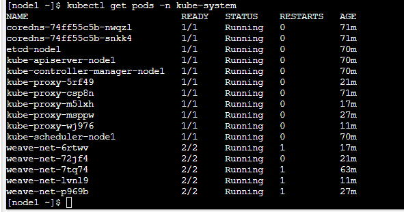

> Img 11. We verify that everything is correctly with the Pods.

## Running Portainer on 5-Node Kubernetes Cluster

### Pre-requisite:

-   Play with Kubernetes Platform.
-   Set up 5 Node Kubernetes Cluster.

## Run the below command:

`kubectl apply -f https://raw.githubusercontent.com/portainer/portainer-k8s/master/portainer-nodeport.yaml`

## Verify

`[node1 kubelabs]$ kubectl get po,svc,deploy -n portainer
NAME READY STATUS RESTARTS AGE
pod/portainer-58767884bc-jqfnn 1/1 Running 2 13m
NAME TYPE CLUSTER-IP EXTERNAL-IP PORT(S) AGE
service/portainer NodePort 10.111.121.188 <none> 9000:30777/TCP,8000:30776/TCP 13m
NAME READY UP-TO-DATE AVAILABLE AGE
deployment.apps/portainer 1/1 1 1 13m
[node1 kubelabs]$`

## Result

Finally we use the ".yaml" file and save it to the GitHub repository.

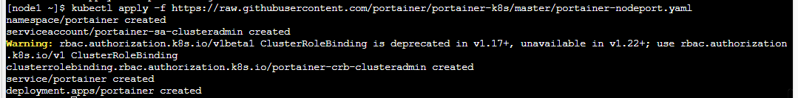

> Img 12. We check what is running on the service, including the Pods.

## Opening up Browser

Go to browser and add the port in the following manner:
`https://ip172-18-0-7-bs6kb2bmjflg00fa5g4g-<ADD 30777 HERE>.direct.labs.play-with-k8s.com/`

Results not obtained

It was not possible to take off the container with the play with Kuber simulator because the ports are not enabled, that is why it must be analyzed in advance that the ports will be used, in the same way, it must be verified that they are correctly use the ip of the master node.

## Conclusions

During the development of the practice I learned to use the play with kubernetes simulator and create a cluster of it, in order to be able to implement virtualization tools in an infrastructure model as a service and facilitate operations carried out in containers for companies. assign master and slave nodes, the truth was interesting how to create and deploy services in kubernetes using ICTs. [Brenda]

Using the play with Kubernetes platform is of great help when the physical equipment has failures, however, I only recommend it to practice because it has certain limitations that can affect the operation of the practice that is being carried out, for example in this case a cluster was made, which is mainly about interlacing various rooms (host), which could be used to see its operation and behavior graphically, however, it could also be used to assign different tasks in a more easy or transfer information in a secure way.
As with docker, I can see that containers are practical and that they can be put to various uses thanks to their portability and scalability. [Karla Lizbeth]

## Importance

Kubernetes offers a container-centric management environment, plus it orchestrates compute, network, and storage infrastructure so user workloads don't have to. Kubernetes is important to use because it offers the flexibility of Infrastructure as a Service (IaaS) and enables portability between infrastructure providers.

## References

[1] Pandao, «Open source online Markdown editor.,» 2019. [En línea]. Available: https://pandao.github.io/editor.md/en.html. [Último acceso: 9 abril 2022].

[2] S. I. S. Ortiz, «Preparing 5-Node Kubernetes Cluster,» 1 abril 2022. [En línea]. Available: https://github.com/ssoto123/Computo_Nube#opening-up-browser. [Último acceso: 9 abril 2022].

[3] Kubernetes, «¿Qué es Kubernetes?,» 11 febrero 2022. [En línea]. Available: https://kubernetes.io/es/docs/concepts/overview/what-is-kubernetes/. [Último acceso: 9 abril 2022].

[4] «¿Qué es un clúster de Kubernetes?,» Redhat, 15 enero 2020. [En línea]. Available: https://www.redhat.com/es/topics/containers/what-is-a-kubernetes-cluster#:~:text=Un%20cl%C3%BAster%20de%20Kubernetes%20es,varias%20m%C3%A1quinas%20inform%C3%A1ticas%20o%20nodos. [Último acceso: 9 abril 2022].

[5] Durbon, «De Docker a Kubernetes: entendiendo qué son los contenedores y por qué es una de las mayores revoluciones de la industria del desarrollo,» xataka, 10 septiembre 2019. [En línea]. Available: https://www.xataka.com/otros/docker-a-kubernetes-entendiendo-que-contenedores-que-mayores-revoluciones-industria-desarrollo. [Último acceso: 9 abril 2022].

[6] Google, «Arquitectura de clúster estándar,» 2019. [En línea]. Available: https://cloud.google.com/kubernetes-engine/docs/concepts/cluster-architecture?hl=es-419. [Último acceso: 9 abril 2022].
